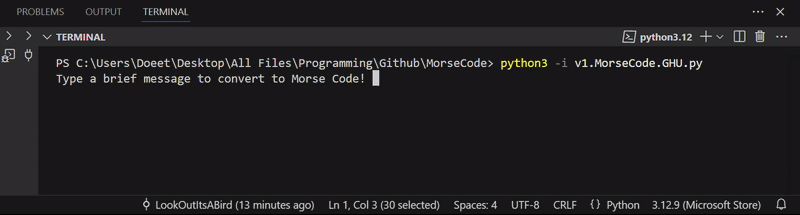

# MorseCode
### Description
Translate a brief message into Morse Code text and audio!

  

Note: The GIF is silent because it doesn't allow audio. Also, audio seems to clip out via earbuds, so use speakers instead!

### Learning Overview
 - sounddevice, sd.play(), time.sleep(), dictionary, linspace(start,stop,steps), np.sin
 - sample rate (44.1k for CD audio quality), nyquist rate, aliasing
 - compilers and interpreters (C, C++, Java / Python, Javascript)
